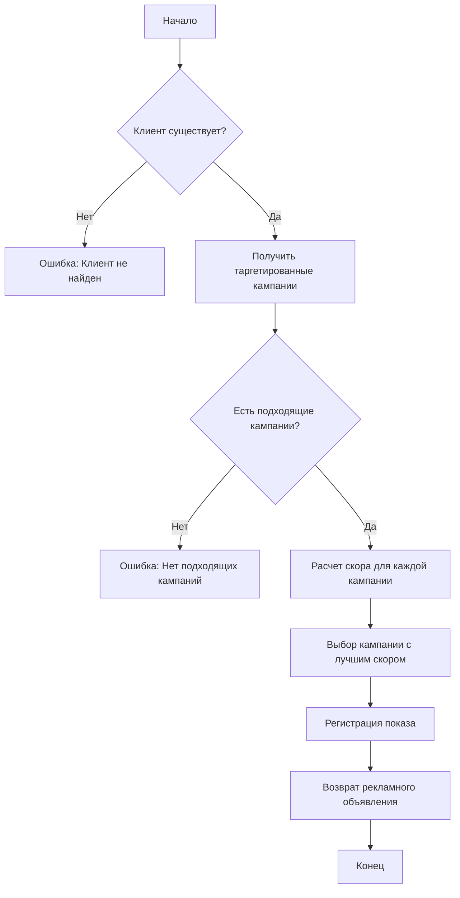
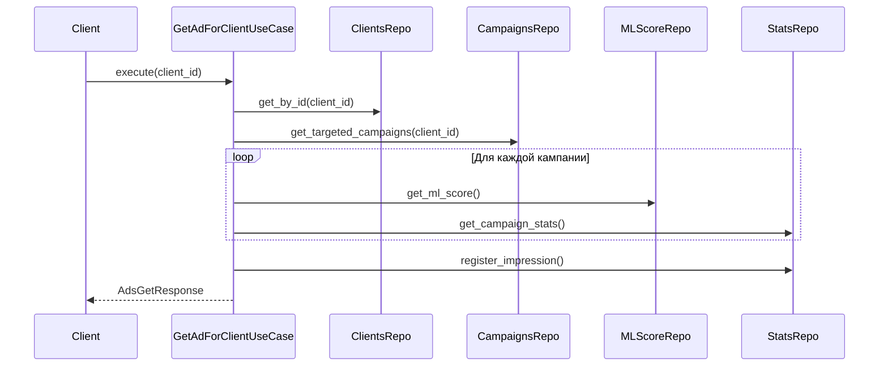

# Prodstar - prodвинутые рекламные решения

## Технологический стек


 


## Основной функционал

### Базовые возможности
- REST API с веб-интерфейсом
- Telegram бот для управления рекламными кампаниями и рекламодателями
- Интерактивные дашборды Grafana для аналитики
### Интеграции
- Генерация рекламного контента с помощью LLM:
  - Тексты объявлений
  - Рекламные изображения
- Синхронизация с API Яндекс.Директ

### Безопасность и модерация
- Двухуровневая система модерации:
  - База запрещенных слов
  - Проверка контента с помощью ИИ

### Дополнительные возможности
- Система отзывов и рейтингов для рекламных кампаний
- Поддержка изображений в объявлениях
- Расширенная аналитика и экспорт данных

Я предлагаю вам познакомиться с веб-интерфейсом. Вы можете сами его опробовать, перейдя на http://REDACTED:8080/web


## Обзор функциональности

### REST API
REST API разработан в соответствии со спецификацией OpenAPI и требованиями технического задания. Была добавлена расширенная функциональность.
Обновленную спецификацию можно найти по адресу http://REDACTED:8080/docs

### Интеграция с ИИ

1. **Генерация рекламных текстов**
   - `GET /generate-ad`
   - Принимает ID рекламодателя и заголовок объявления
   - Создает уникальный рекламный текст на основе входных данных

2. **Создание рекламных изображений**
   - `GET /generate-image`
   - Принимает ID рекламной кампании
   - Генерирует и возвращает изображение, оптимизированное под кампанию

### Система модерации

Реализована двухуровневая система проверки контента:

1. **Модерация по базе данных**
   - Эндпоинты:
     - `GET /forbidden-words` - получение списка запрещенных слов
     - `PUT /forbidden-words` - обновление базы запрещенных слов

2. **Модерация с помощью ИИ**
   - Использует модель Gemini через платформу Openrouter
   - Настройки в .env файле:
     ```
     AI_MODERATION_ENABLED=true
     AI_CHECK_PROFANITY=true
     AI_CHECK_OFFENSIVE=true
     AI_CHECK_INAPPROPRIATE=true
     ```

### Статистика

Добавлены новые эндпоинты для получения статистики:

- **Статистика по клиентам**
  - `GET /stats/clients`
  - Возвращает агрегированную статистику по всем клиентам

- **Отзывы о рекламных кампаниях**
  - `GET /stats/campaigns/{campaignId}/feedback` 
  - Возвращает:
    - Рейтинг кампании
    - Комментарии пользователей
    - Статистику взаимодействий

### Отзывы о рекламных объявлениях

- `POST /ads/feedback`
- Сохраняет отзыв о рекламном объявлении
- Параметры:
  - `ad_id` - ID рекламного объявления
  - `client_id` - ID клиента
  - `rating` - Рейтинг (1-5)
  - `comment` - Комментарий

### Интеграция с Яндекс.Директ

Реализована синхронизация с API Яндекс.Директ через следующие эндпоинты:

- **Получение кампаний**
  - `GET /advertisers/{advertiserId}/yandex`
  - Параметры: ID рекламодателя, токен Яндекс.Директ
  - Возвращает список активных рекламных кампаний из Яндекс.Директ

- **Импорт кампаний**
  - `POST /advertisers/{advertiserId}/yandex`
  - Параметры: ID рекламодателя, токен Яндекс.Директ  
  - Импортирует выбранные кампании из Яндекс.Директ в систему

В .env файл уже лежит токен Яндекса, поэтому для тестов можно не вводить токен.

### Работа с изображениями

В схему рекламной кампании добавлено поле `image_url`. Реализованы следующие эндпоинты для работы с изображениями:

- **Загрузка/обновление изображения**
  - `POST /advertisers/{advertiserId}/campaigns/{campaignId}/image`
  - Параметры:
    - ID рекламодателя
    - ID кампании
  - Тело запроса: 
    - Файл изображения (jpeg, png, gif, webp)
    - Content-Type: multipart/form-data

- **Удаление изображения**
  - `DELETE /advertisers/{advertiserId}/campaigns/{campaignId}/image`
  - Параметры:
    - ID рекламодателя
    - ID кампании

### Экспорт данных

В системе реализован экспорт данных в формате запакованного архива .zip, включающего в себя данные рекламодателя, кампаний и статистику в форматах .json и .csv. Реализован следующий эндпоинт:
- **Экспорт данных**
   -  `GET /{advertiser_id}/export`
     Параметры: ID рекламодателя
     -  Возвращает данные рекламодателя в формате .zip

### Графики Grafana

В системе реализованы следующие графики для аналитики:

- **Показы и конверсии**
  - Количество показов по дням
  - Конверсия кликов по кампаниям (топ 10)

- **Демографические данные**
  - Распределение пользователей по возрасту
  - География пользователей

- **Эффективность кампаний**
  - Средний рейтинг рекламных кампаний
  - Активность по времени суток

Работает по адресу http://REDACTED:3000. Логин и пароль для входа: admin/admin

### Telegram бот

Реализован Telegram бот. Основной функционал:

- **Работа с рекламодателями**
  - Создание нового рекламодателя
  - Просмотр информации о существующих
  - Редактирование данных

- **Управление рекламными кампаниями**
  - Создание новых кампаний
  - Настройка таргетинга
  - Просмотр статистики

Для начала работы найдите бота по имени @neprodstar_bot и отправьте команду /start

### Алгоритм выбора рекламного объявления

Система использует оптимальный алгоритм для выбора рекламного объявления, учитывая три основных фактора:

#### ML-скоринг (25%)
- Оценка релевантности объявления пользователю
- При отсутствии данных используется нулевое значение

#### Экономические показатели (30%)
- Оценка потенциальной прибыли с учетом CPM, CPC и оставшихся лимитов показов/кликов

#### Выполнение целей кампании (35%)
- Отслеживание выполнения целевых показателей по показам и кликам
- Нормализация до диапазона [0,1]

Итоговый рейтинг кампании вычисляется как взвешенная сумма этих факторов. Выбирается кампания с максимальным рейтингом.

## Процесс показа рекламы

### Блок-схема работы метода показа рекламы


### Диаграмма последовательности

    
## Обоснование выбора стека

**FastAPI**
FastAPI был выбран из-за своей высокой производительности, популярности (отличная документация и поддержка), удобной валидации данных через Pydantic. 

**PostgreSQL**
PostgreSQL имеет поддержку сложных SQL-запросов и транзакций, необходимых для работы рекламной платформы. Он гибок в типах данных, масштабируем, поддерживает параллельные операции.

**Redis**
Redis используется как быстрое хранилище для кэширования текущего дня. 

**SQLAlchemy**
SQLAlchemy обеспечивает мощный и гибкий ORM-слой для работы с базой данных, сильно упрощает разработку. Поддерживает асинхронные операции.

**MinIO**
Совместимое с Amazon S3 хранилище для изображений рекламных объявлений. Его высокая производительность и масштабируемость позволяют эффективно хранить и раздавать рекламные изображения. Очень прост в развертывании и управлении.

**aiogram**
Aiogram был выбран из-за асихронности, поддержки FSM (машины состояний), простоты разработки, поддержки большинства функций Telegram.

## Схема базы данных


## Docker Compose

В проекте используются следующие сервисы:
### Основные сервисы (docker-compose.yml)

- **app** - Основной FastAPI сервер с REST API и веб-интерфейсом
- **telegram-bot** - Telegram бот для управления рекламными кампаниями
- **postgres** - База данных PostgreSQL для хранения основных данных
- **redis** - Redis для кэширования и временных данных
- **prometheus** - Сбор метрик для мониторинга
- **grafana** - Визуализация метрик и аналитических дашбордов
- **minio** - S3-совместимое хранилище для рекламных изображений
### Тестовые сервисы (docker-compose.test.yml)

- **test** - Контейнер для запуска тестов
- **postgres-test** - Отдельная БД PostgreSQL для тестов
- **redis-test** - Отдельный Redis для тестов

## Запуск проекта

Выполните команду:
```bash
docker compose up --build
```

## Запуск unit тестов

Выполните команду:
```bash
docker compose -f docker-compose.test.yml up
```

## Запуск e2e тестов

1. Перейдите в e2e папку
2. Установите зависимости:
```bash
uv sync
```

3. Запустите тесты:
```bash
uv run pytest
```

Мною написанные unit и e2e тесты должны идеально проходить. Если этого не происходит, попробуйте очистить базу данных и запустить их снова.
